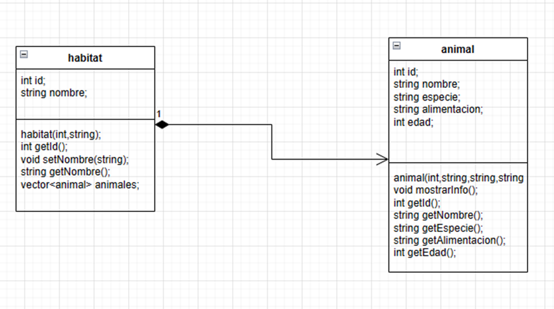

# Proyecto-Zoologico
primer proyecto POO

- auto evaluacion

El mayor reto que hubo fue que el programa funcionara a pesar de que el usuario digitara algo posiblemente erróneo o que no concuerde con la realidad, siguiendo las indicaciones del proyecto, de la forma que se logro fue limitando el usuario un poco para que los animales que agregara concordaran con los hábitats en los que podían coexistir ya que se podía dar el caso que el usuario agregara un león a un hábitat acuático lo cual no tiene sentido, la idea principal es que casi todo los parámetros para crear y agregar el animal lo escribió el usuario pero por lo anterior lo mejor fue limitar al usuario mediante opción predefinidas las cuales no pueden romper las reglas predefinidas, además del problema de los animales también estuvo el de los hábitats el cual tenia como idea principal que el usuario colocara cualquier hábitat que quisiera pero después me di cuenta que literalmente podía ser cualquier cosa lo cual rompía un poco con la lógica de un zoológico, debido a eso lo limite a 3 habitas, por ultimo a la hora de eliminar bien se un animal o hábitat se podía presentar que casi todas sus características fueran iguales como la especie o el nombre y para que el programa no eliminara al primero de los dos que se encontrara decidí añadirle id a los hábitats y a los animales

- diagrama UML

